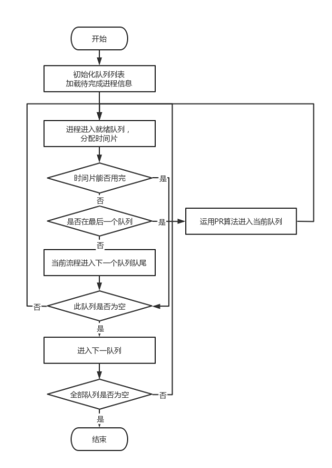
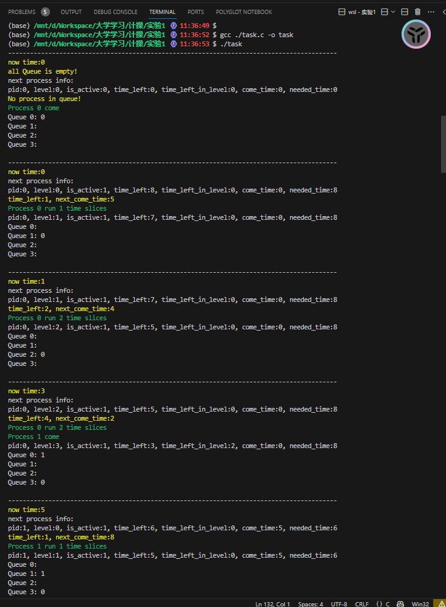
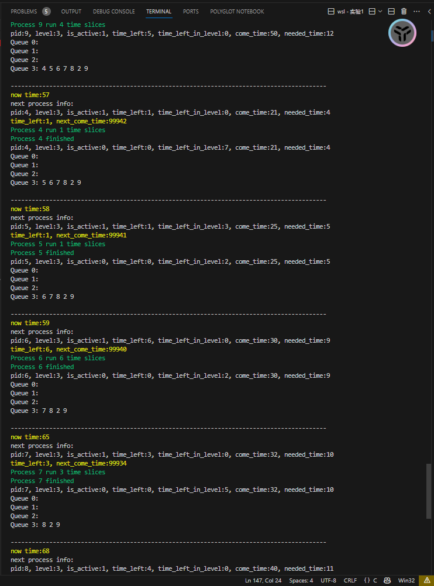
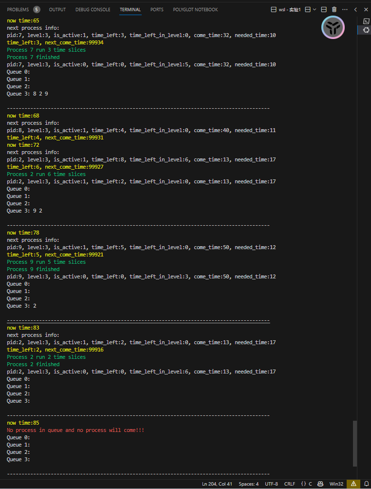

# 实验一：多级反馈队列

## 实验目的

通过模拟多级反馈队列进程调度算法，加深对进程调度算法、分时系统、时间片、进程优先级、进程状态、进程控制的理解。

## 实验内容

用C语言或Python编写一个程序，模拟多级反馈队列调度算法的执行过程，要求：

1. 队列4级，每一级的队列长度都为10，第一级的时间片为T，第二级的时间片为2T，第三级的时间片为4T，第四级的时间片为8T；（T的大小自己定）

2. 立即抢占的调度算法；

3. 要有：在调度n级（n>1）队列时，有新来的进程进入系统。

## 程序流程图



## 程序代码

本次使用了C语言进行程序编写，主要代码如下：

### 结构体与变量

#### 基础时间

```c
int T_list[LEVELS] = {1,2,4,8};
```

#### 进程

```c
typedef struct Process{
    int pid;         // 进程标识符
    int level;       // 进程所在队列级别
    bool is_active;  // 进程是否处于活跃状态
    int time_left;   // 进程剩余执行时间
    int time_left_in_level; // 进程在当前队列中剩余执行时间
    int come_time;   // 进程到达时间
    int needed_time;  // 进程所需执行时间
}Process;
```

#### 多级队列

```c
Process queues[LEVELS][MAX_PROCESSES]; // 多级队列
// 用于确定队列首位
int front[LEVELS] = {0}, rear[LEVELS] = {0}; // 队列头尾指针
```

#### 存储即将运行的进程

```c
// 存储即将来的进程
Process comelist[MAX_PROCESSES];
// 目前来了几个进程
int comenum = 0;
```

### 函数

#### 初始化队列

```c
void initialize_queues() {
    for (int i = 0; i < LEVELS; ++i) {
        for (int j = 0; j < MAX_PROCESSES; ++j) {
            queues[i][j].is_active = false;
        }
        front[i] = rear[i] = 0;
    }
}

```

#### 初始化进程

```c
void init_process() {
    int pid_list[] = {0, 1, 2, 3, 4, 5, 6, 7, 8, 9};
    int time_need[] = {8, 6, 17, 3, 4, 5, 9, 10, 11, 12};
    int come_time[] = {0, 5,  13, 20, 21, 25, 30, 32,40,50};
    for (int i = 0; i < MAX_PROCESSES; ++i) {
        comelist[i].pid = pid_list[i];
        comelist[i].time_left = time_need[i];
        comelist[i].come_time = come_time[i];
        comelist[i].needed_time = time_need[i];
        comelist[i].is_active = true;
    }
}
```

#### 其他

```c
bool is_full(int level); // 判断队列是否满
void enqueue(int level, Process process); // 将进程放入队列
bool is_empty(int level); // 判断队列是否空
bool is_all_empty(); // 判断是否所有队列都为空
Process dequeue(int level); // 从队列中取出进程
void print_queue(int level); // 打印队列中的进程
void print_queues(); // 打印全部队列
```

#### 调度算法

```c
void schedule() {
    printf("------------------------------------------------------------------------------------------\n");
    yellow_printf("now time:%d\n",time);
    // 先获得最近一次进程即将到来的时间
    int next_come_time = comelist[comenum].come_time;
    if(comenum == MAX_PROCESSES){
        next_come_time = MAXTIME;
    }
    // 当没有更多任务且队列为空时，结束调度
    if(next_come_time == MAXTIME && is_all_empty()){
        red_printf("No process in queue and no process will come!!!\n");
        return;
    }
    // 当前时间与最近一次进程即将到来的时间只差
    int time_com = next_come_time - time;
    // 获得优先调度的任务
    Process process = dequeue(0);
    //即将执行的任务信息
    puts("next process info:");
    print_porcess(process);
    if(process.is_active == false) {
        yellow_printf("No process in queue!\n");
        time = next_come_time;
        if(comenum < MAX_PROCESSES){
            green_printf("Process %d come\n", comelist[comenum].pid);
            enqueue(0, comelist[comenum++]);
        }
        return;
    }
    // 如果进程未在执行状态，把他放进CPU
    if(!process.time_left_in_level){
        process.time_left_in_level = T_list[process.level];
    }
    // 获取time_left_in_level和time_left中的较小值
    int time_left = process.time_left_in_level < process.time_left ? process.time_left_in_level : process.time_left;
    yellow_printf("time_left:%d, next_come_time:%d\n",time_left,time_com);
    // 如果进程剩余执行时间小于时间片
    if(time_left <= time_com){
        // 将进程执行完
        time += time_left;
        process.time_left -= time_left;
        process.time_left_in_level -= time_left;
        green_printf("Process %d run %d time slices\n", process.pid, time_left);
        // 如果进程还未执行完
        if(process.time_left){
            // 将进程放入下一级队列
            if(process.level < LEVELS - 1)
                process.level++;
            enqueue(process.level, process);
            print_porcess(process);
        }
        // 如果进程完成
        else{
            process.is_active = false;
            green_printf("Process %d finished\n", process.pid);
            print_porcess(process);
        }
        // 完成这轮后正好新任务来了
        if(time_left == time_com){
            // 将新任务放入队列
            if(comenum < MAX_PROCESSES){
                green_printf("Process %d come\n", comelist[comenum].pid);
                enqueue(0, comelist[comenum++]);
            }
            return;
        }
        return;
        
    }
    // 如果进程进行到一半时新任务来了
    else if(time_left > time_com){
        // 将进程执行time_com时间
        time += time_com;
        process.time_left -= time_com;
        process.time_left_in_level -= time_com;
        green_printf("Process %d run %d time slices\n", process.pid, time_com);
        // 将进程放入下一级队列
        if(process.level < LEVELS - 1)
            process.level++;
        enqueue(process.level, process);
        // 将新任务放入队列
        if(comenum < MAX_PROCESSES){
            green_printf("Process %d come\n", comelist[comenum].pid);
            enqueue(0, comelist[comenum++]);
        }
        print_porcess(process);
        return;
    }
}
```


## 运行结果

传入的进程信息见上述代码







## 结果分析